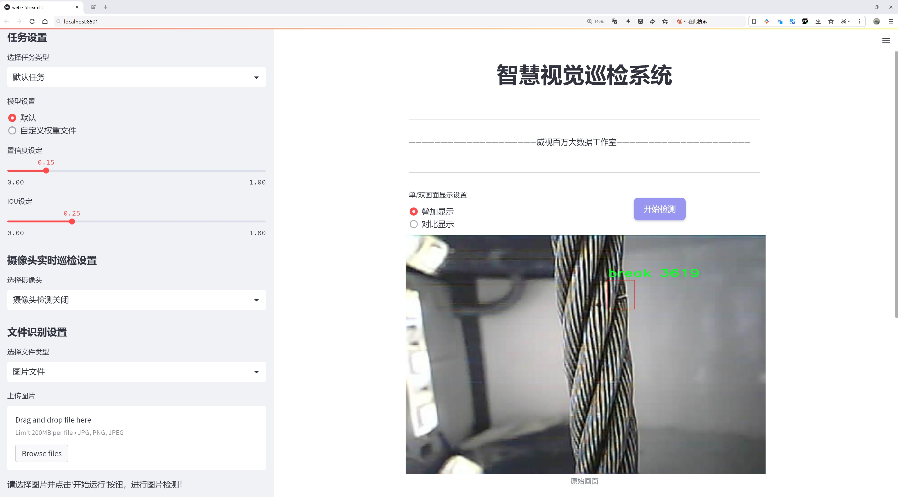
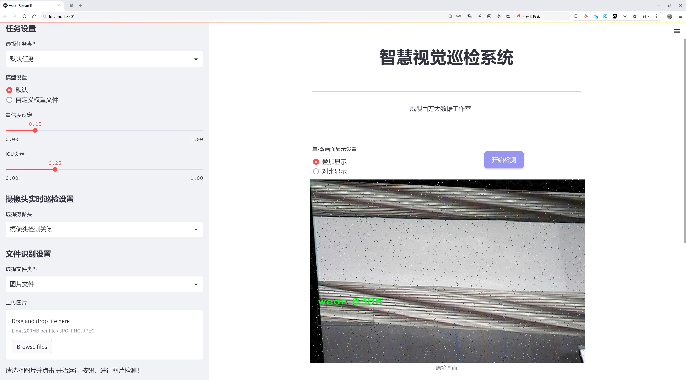
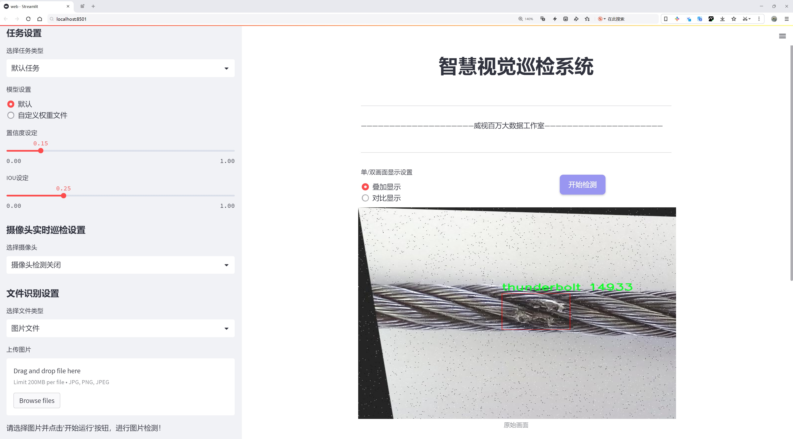
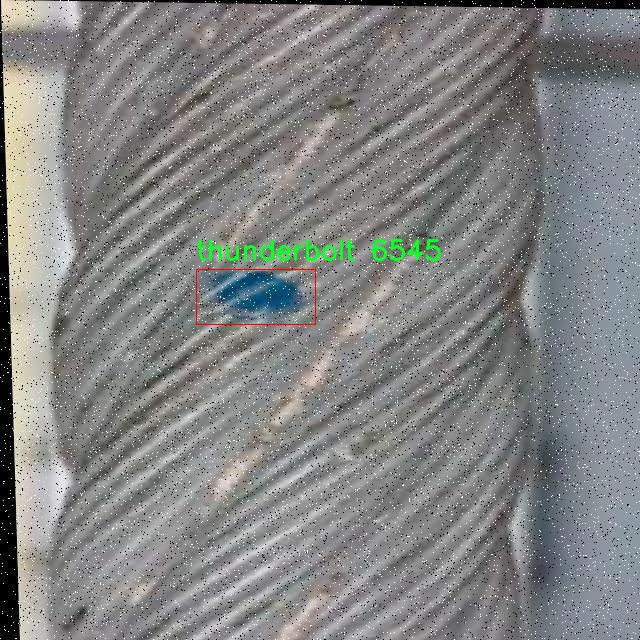
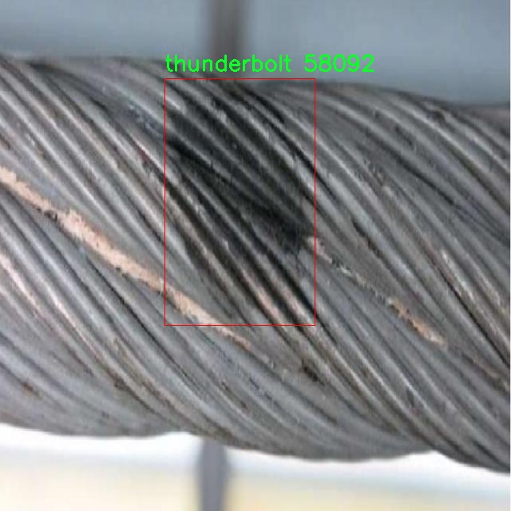
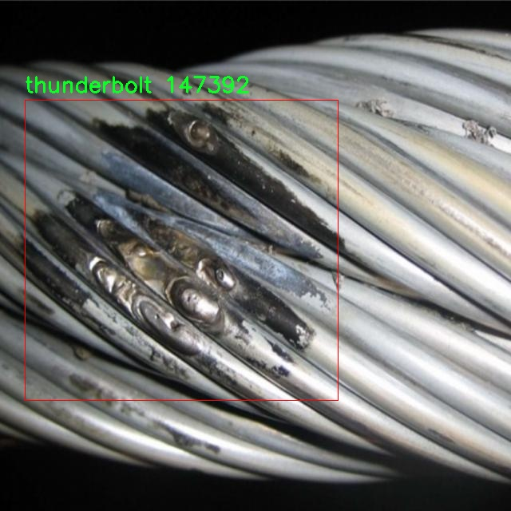
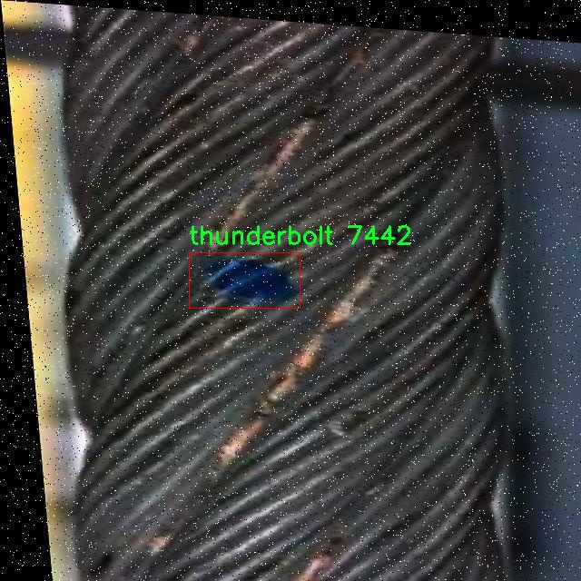
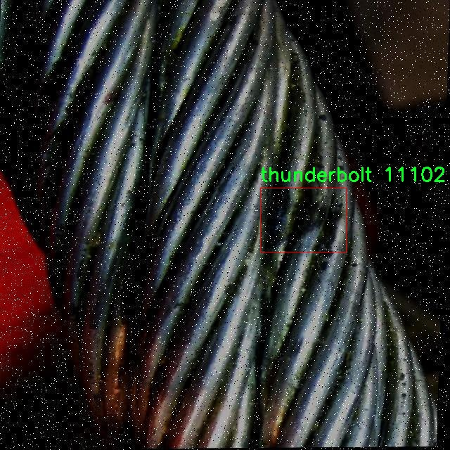

# 钢索缺陷检测检测系统源码分享
 # [一条龙教学YOLOV8标注好的数据集一键训练_70+全套改进创新点发刊_Web前端展示]

### 1.研究背景与意义

项目参考[AAAI Association for the Advancement of Artificial Intelligence](https://gitee.com/qunshansj/projects)

项目来源[AACV Association for the Advancement of Computer Vision](https://gitee.com/qunmasj/projects)

研究背景与意义

随着现代工程技术的不断发展，钢索作为桥梁、建筑物及其他结构的重要组成部分，其安全性和可靠性直接关系到公共安全和经济效益。然而，钢索在长期使用过程中，常常会受到环境因素、负载变化以及材料疲劳等多种因素的影响，导致出现不同类型的缺陷，如断裂、磨损和腐蚀等。这些缺陷不仅影响钢索的承载能力，还可能引发严重的安全事故。因此，及时、准确地检测钢索缺陷，对于保障工程结构的安全性至关重要。

传统的钢索缺陷检测方法主要依赖人工检查和简单的仪器检测，这些方法不仅效率低下，而且容易受到人为因素的影响，导致漏检或误检。随着计算机视觉和深度学习技术的迅速发展，基于图像处理的自动化检测方法逐渐成为研究的热点。YOLO（You Only Look Once）系列模型因其高效的实时目标检测能力，已被广泛应用于各类物体检测任务中。特别是YOLOv8作为该系列的最新版本，凭借其更为精确的检测能力和更快的推理速度，为钢索缺陷检测提供了新的技术路径。

本研究旨在基于改进的YOLOv8模型，构建一个高效的钢索缺陷检测系统。我们将利用包含4300张图像的数据集，数据集中涵盖了三类钢索缺陷：断裂（break）、雷击（thunderbolt）和磨损（wear）。这些类别的细分不仅有助于提高检测的准确性，也为后续的缺陷分析和处理提供了更为详细的信息。通过对数据集的深入分析和模型的优化，我们期望能够提升系统在实际应用中的鲁棒性和适应性。

本研究的意义在于，首先，利用改进的YOLOv8模型进行钢索缺陷检测，可以显著提高检测的效率和准确性，减少人工检查的工作量，从而降低人力成本和时间成本。其次，基于深度学习的检测系统能够实时监测钢索状态，及时发现潜在的安全隐患，为工程维护提供科学依据，进而提高工程结构的安全性。此外，本研究还将为钢索缺陷检测领域提供新的思路和方法，推动相关技术的发展。

综上所述，基于改进YOLOv8的钢索缺陷检测系统的研究，不仅具有重要的理论价值，也具备广泛的实际应用前景。通过对钢索缺陷的自动化检测，我们希望能够为工程安全管理提供更为高效、可靠的技术支持，促进工程建设的可持续发展。

### 2.图片演示







##### 注意：由于此博客编辑较早，上面“2.图片演示”和“3.视频演示”展示的系统图片或者视频可能为老版本，新版本在老版本的基础上升级如下：（实际效果以升级的新版本为准）

  （1）适配了YOLOV8的“目标检测”模型和“实例分割”模型，通过加载相应的权重（.pt）文件即可自适应加载模型。

  （2）支持“图片识别”、“视频识别”、“摄像头实时识别”三种识别模式。

  （3）支持“图片识别”、“视频识别”、“摄像头实时识别”三种识别结果保存导出，解决手动导出（容易卡顿出现爆内存）存在的问题，识别完自动保存结果并导出到tempDir中。

  （4）支持Web前端系统中的标题、背景图等自定义修改，后面提供修改教程。

  另外本项目提供训练的数据集和训练教程,暂不提供权重文件（best.pt）,需要您按照教程进行训练后实现图片演示和Web前端界面演示的效果。

### 3.视频演示

[3.1 视频演示](https://www.bilibili.com/video/BV1xStjeQEJp/)

### 4.数据集信息展示

##### 4.1 本项目数据集详细数据（类别数＆类别名）

nc: 3
names: ['break', 'thunderbolt', 'wear']


##### 4.2 本项目数据集信息介绍

数据集信息展示

在本研究中，我们使用了名为“kanaaat”的数据集，旨在训练和改进YOLOv8模型，以实现高效的钢索缺陷检测。该数据集专门针对钢索的不同缺陷类型进行了精心的标注和整理，包含了三种主要的缺陷类别：断裂（break）、雷击（thunderbolt）和磨损（wear）。这些类别的选择反映了在实际应用中钢索可能面临的常见问题，具有重要的实用价值和研究意义。

“kanaaat”数据集的构建过程经过了严格的标准化和验证，确保了数据的质量和标注的准确性。每个类别的样本均经过精心挑选，涵盖了多种环境和条件下的钢索图像，以提高模型的泛化能力。数据集中包含的图像数量和多样性，使得模型在训练过程中能够学习到丰富的特征，从而更好地识别和分类不同类型的缺陷。

在“kanaaat”数据集中，断裂（break）类别主要包括了由于过载、疲劳或材料老化等原因导致的钢索断裂的图像。这些图像展示了不同角度和光照条件下的断裂特征，为模型提供了多样化的学习样本。雷击（thunderbolt）类别则包含了因雷电击中而导致的钢索损伤的图像，这类缺陷在某些地区的钢索维护中尤为重要，及时的检测能够有效避免潜在的安全隐患。磨损（wear）类别则集中在钢索在长期使用过程中，由于摩擦和环境因素造成的表面磨损现象。这种磨损不仅影响钢索的强度和耐用性，还可能导致更严重的结构性问题，因此其检测和监测显得尤为重要。

为了确保模型的训练效果，数据集的划分也经过了精心设计，通常包括训练集、验证集和测试集的分配。这样的划分不仅有助于模型在训练过程中进行有效的学习，还能在验证和测试阶段提供客观的性能评估。通过对“kanaaat”数据集的使用，我们期望能够提升YOLOv8在钢索缺陷检测任务中的准确性和鲁棒性。

此外，数据集的多样性和丰富性也为后续的研究提供了良好的基础。研究人员可以在此基础上进行更深入的分析，探索不同缺陷类型之间的关联性，以及如何通过改进算法来进一步提升检测的效率和准确性。随着对钢索缺陷检测需求的不断增加，像“kanaaat”这样的数据集将发挥越来越重要的作用，推动相关领域的技术进步和应用创新。

总之，“kanaaat”数据集不仅为YOLOv8模型的训练提供了坚实的基础，也为钢索缺陷检测技术的发展开辟了新的方向。通过对该数据集的深入研究和应用，我们有望在钢索安全监测领域取得更为显著的成果，为工程安全和维护提供有力的技术支持。











### 5.全套项目环境部署视频教程（零基础手把手教学）

[5.1 环境部署教程链接（零基础手把手教学）](https://www.ixigua.com/7404473917358506534?logTag=c807d0cbc21c0ef59de5)


[5.2 安装Python虚拟环境创建和依赖库安装视频教程链接（零基础手把手教学）](https://www.ixigua.com/7404474678003106304?logTag=1f1041108cd1f708b01a)

### 6.手把手YOLOV8训练视频教程（零基础小白有手就能学会）

[6.1 手把手YOLOV8训练视频教程（零基础小白有手就能学会）](https://www.ixigua.com/7404477157818401292?logTag=d31a2dfd1983c9668658)

### 7.70+种全套YOLOV8创新点代码加载调参视频教程（一键加载写好的改进模型的配置文件）

[7.1 70+种全套YOLOV8创新点代码加载调参视频教程（一键加载写好的改进模型的配置文件）](https://www.ixigua.com/7404478314661806627?logTag=29066f8288e3f4eea3a4)

### 8.70+种全套YOLOV8创新点原理讲解（非科班也可以轻松写刊发刊，V10版本正在科研待更新）

由于篇幅限制，每个创新点的具体原理讲解就不一一展开，具体见下列网址中的创新点对应子项目的技术原理博客网址【Blog】：


[8.1 70+种全套YOLOV8创新点原理讲解链接](https://gitee.com/qunmasj/good)

### 9.系统功能展示（检测对象为举例，实际内容以本项目数据集为准）

图9.1.系统支持检测结果表格显示

  图9.2.系统支持置信度和IOU阈值手动调节

  图9.3.系统支持自定义加载权重文件best.pt(需要你通过步骤5中训练获得)

  图9.4.系统支持摄像头实时识别

  图9.5.系统支持图片识别

  图9.6.系统支持视频识别

  图9.7.系统支持识别结果文件自动保存

  图9.8.系统支持Excel导出检测结果数据


### 10.原始YOLOV8算法原理

原始YOLOv8算法原理

YOLOv8是由Ultralytics公司于2023年发布的最新一代YOLO系列算法，其设计理念旨在进一步提升目标检测的精度和速度。作为YOLO系列的延续，YOLOv8不仅在架构上进行了创新，还在功能上扩展了应用场景，成为计算机视觉领域中最先进的模型之一。本文将重点探讨YOLOv8n的原始算法原理，揭示其在特征提取、网络结构、损失函数等方面的独特设计。

YOLOv8n作为YOLOv8系列中的一个轻量级模型，采用了C2f模块替代了YOLOv5中的C3模块。这一创新设计的核心在于C2f模块引入了更多的残差连接，增强了梯度信息的传递能力，从而在轻量化的基础上提升了模型的表现。C2f模块的设计灵感部分来源于YOLOv7中的ELAN模块，通过结合多种结构的优点，YOLOv8n能够在特征提取阶段实现更高效的特征学习。

在主干网络方面，YOLOv8n采用了CSP（Cross Stage Partial）结构，这种结构将特征提取过程分为两部分，分别进行卷积和连接。这种分离的设计使得网络在处理特征时能够更灵活地选择和组合信息，进而提高了模型的整体性能。CSP结构的引入不仅增强了网络的表达能力，还有效地降低了计算复杂度，使得YOLOv8n在实时检测任务中表现出色。

YOLOv8n的颈部网络采用了PAN-FPN（Path Aggregation Network - Feature Pyramid Network）结构，这一结构在特征多尺度融合方面表现优异。PAN-FPN通过自下而上的路径和自上而下的路径相结合，能够有效地整合不同尺度的特征信息，提升了小目标的检测能力。相较于传统的特征融合方法，PAN-FPN的设计更为灵活，能够适应不同场景下的需求。

在检测网络的设计上，YOLOv8n采用了Anchor-Free的检测方式，这一创新使得模型在目标检测时不再依赖于预定义的锚框。传统的Anchor-Based方法在处理不同尺度和形状的目标时常常面临挑战，而Anchor-Free方法则通过直接回归目标的边界框坐标，简化了检测过程，提高了检测的准确性和效率。YOLOv8n的Detect模块使用了解耦头结构，将分类和回归任务分开处理，这一设计不仅提高了模型的可解释性，还增强了模型在复杂场景下的鲁棒性。

在损失函数的设计上，YOLOv8n引入了CloU作为主要的损失计算方式，结合了BCELoss作为分类损失和DFLLoss+CIoULoss作为回归损失。这种多元化的损失计算方式使得模型在训练过程中能够更好地平衡分类和回归任务的优化，进而提升了整体的检测性能。通过精细化的损失函数设计，YOLOv8n能够在训练过程中更有效地捕捉到目标的特征信息，从而实现更高的检测精度。

此外，YOLOv8n在数据增强方面也进行了创新，采用了动态Task-Aligned Assigner样本分配策略，并在训练的最后10个epoch中关闭了马赛克增强。这一策略的实施旨在提升模型对真实场景的适应能力，减少过拟合现象的发生，从而提高模型在实际应用中的表现。

总的来说，YOLOv8n通过对网络结构的多项创新和优化，成功地提升了目标检测的精度和速度。其在特征提取、网络设计、损失计算等方面的独特思路，使得YOLOv8n在处理复杂场景和小目标检测时表现尤为突出。随着YOLOv8的发布，目标检测技术迎来了新的发展机遇，未来的研究和应用将更加广泛，推动计算机视觉领域的进一步发展。


### 11.项目核心源码讲解（再也不用担心看不懂代码逻辑）

#### 11.1 code\ultralytics\models\yolo\obb\val.py

以下是经过精简和注释的核心代码部分，保留了最重要的功能和逻辑。

```python
# Ultralytics YOLO 🚀, AGPL-3.0 license

from pathlib import Path
import torch
from ultralytics.models.yolo.detect import DetectionValidator
from ultralytics.utils import ops
from ultralytics.utils.metrics import OBBMetrics, batch_probiou
from ultralytics.utils.plotting import output_to_rotated_target, plot_images

class OBBValidator(DetectionValidator):
    """
    OBBValidator类用于基于定向边界框（OBB）模型的验证。
    """

    def __init__(self, dataloader=None, save_dir=None, pbar=None, args=None, _callbacks=None):
        """初始化OBBValidator并将任务设置为'obb'，指标设置为OBBMetrics。"""
        super().__init__(dataloader, save_dir, pbar, args, _callbacks)
        self.args.task = "obb"  # 设置任务类型为OBB
        self.metrics = OBBMetrics(save_dir=self.save_dir, plot=True, on_plot=self.on_plot)  # 初始化指标

    def postprocess(self, preds):
        """对预测输出应用非极大值抑制（NMS）。"""
        return ops.non_max_suppression(
            preds,
            self.args.conf,  # 置信度阈值
            self.args.iou,   # IoU阈值
            labels=self.lb,
            nc=self.nc,
            multi_label=True,
            agnostic=self.args.single_cls,
            max_det=self.args.max_det,
            rotated=True,    # 处理旋转框
        )

    def _process_batch(self, detections, gt_bboxes, gt_cls):
        """
        返回正确的预测矩阵。

        参数:
            detections (torch.Tensor): 形状为[N, 6]的检测张量，每个检测格式为: x1, y1, x2, y2, conf, class。
            gt_bboxes (torch.Tensor): 形状为[M, 5]的标签张量，每个标签格式为: class, x1, y1, x2, y2。

        返回:
            (torch.Tensor): 形状为[N, 10]的正确预测矩阵，表示10个IoU水平。
        """
        iou = batch_probiou(gt_bboxes, torch.cat([detections[:, :4], detections[:, -1:]], dim=-1))  # 计算IoU
        return self.match_predictions(detections[:, 5], gt_cls, iou)  # 匹配预测与真实标签

    def plot_predictions(self, batch, preds, ni):
        """在输入图像上绘制预测的边界框并保存结果。"""
        plot_images(
            batch["img"],
            *output_to_rotated_target(preds, max_det=self.args.max_det),  # 输出旋转目标
            paths=batch["im_file"],
            fname=self.save_dir / f"val_batch{ni}_pred.jpg",  # 保存文件名
            names=self.names,
            on_plot=self.on_plot,
        )

    def eval_json(self, stats):
        """评估YOLO输出的JSON格式并返回性能统计信息。"""
        if self.args.save_json and len(self.jdict):
            import json
            from collections import defaultdict

            pred_json = self.save_dir / "predictions.json"  # 预测结果文件
            pred_txt = self.save_dir / "predictions_txt"  # 文本预测结果目录
            pred_txt.mkdir(parents=True, exist_ok=True)  # 创建目录
            data = json.load(open(pred_json))  # 加载JSON数据

            # 保存分割结果
            for d in data:
                image_id = d["image_id"]
                score = d["score"]
                classname = self.names[d["category_id"]].replace(" ", "-")
                p = d["poly"]

                with open(f'{pred_txt / f"Task1_{classname}"}.txt', "a") as f:
                    f.writelines(f"{image_id} {score} {' '.join(map(str, p))}\n")  # 保存预测结果

        return stats  # 返回统计信息
```

### 代码分析和注释说明：

1. **类定义**：`OBBValidator` 继承自 `DetectionValidator`，用于处理定向边界框的验证任务。

2. **初始化方法**：在初始化中，设置任务类型为 `obb`，并初始化用于评估的指标 `OBBMetrics`。

3. **后处理方法**：`postprocess` 使用非极大值抑制（NMS）来过滤掉冗余的检测结果，确保每个检测框的唯一性。

4. **批处理方法**：`_process_batch` 计算预测框与真实框之间的IoU，并返回匹配的预测结果。

5. **绘图方法**：`plot_predictions` 用于在输入图像上绘制预测的边界框，并将结果保存为图像文件。

6. **评估方法**：`eval_json` 负责将预测结果保存为JSON格式，并根据需要将结果输出为文本文件。

这些核心部分构成了OBBValidator的主要功能，能够有效地处理定向边界框的验证和评估任务。

该文件定义了一个名为 `OBBValidator` 的类，继承自 `DetectionValidator`，用于基于定向边界框（Oriented Bounding Box, OBB）模型的验证。该类主要用于处理和评估目标检测模型的性能，特别是在处理具有旋转边界框的目标时。

在初始化方法中，`OBBValidator` 设置了任务类型为 "obb"，并初始化了评估指标 `OBBMetrics`，该指标用于计算模型在验证集上的性能。初始化时还接受了一些参数，如数据加载器、保存目录、进度条、其他参数和回调函数。

`init_metrics` 方法用于初始化评估指标，获取验证数据的路径，并判断数据集是否为 DOTA 格式。DOTA 是一个常用的目标检测数据集，特别适用于旋转边界框的任务。

`postprocess` 方法应用非极大值抑制（Non-Maximum Suppression, NMS）来处理模型的预测输出，以减少冗余的检测结果。这个过程通过调用 `ops.non_max_suppression` 函数实现，允许用户设置置信度阈值、IoU 阈值等参数。

`_process_batch` 方法处理一批检测结果，计算每个检测与真实边界框之间的交并比（IoU），并返回正确的预测矩阵。该方法接受检测结果和真实标签作为输入，输出一个包含 IoU 级别的矩阵。

`_prepare_batch` 方法准备并返回一批用于 OBB 验证的数据，包括类别、边界框、原始图像形状等信息。该方法还会根据图像的尺寸和填充比例对边界框进行缩放。

`_prepare_pred` 方法对预测结果进行处理，调整边界框的大小和位置，以适应原始图像的尺寸。

`plot_predictions` 方法用于在输入图像上绘制预测的边界框，并将结果保存为图像文件。它调用 `plot_images` 函数，将预测结果可视化。

`pred_to_json` 方法将 YOLO 的预测结果序列化为 COCO JSON 格式，便于后续的分析和评估。它会提取每个预测的图像 ID、类别 ID、置信度、旋转边界框和多边形坐标，并将这些信息存储在一个字典中。

`save_one_txt` 方法将 YOLO 的检测结果保存到一个文本文件中，采用规范化坐标格式。该方法根据输入的形状进行坐标归一化，并将结果写入指定的文件。

`eval_json` 方法评估 YOLO 输出的 JSON 格式结果，并返回性能统计信息。如果设置了保存 JSON 的参数，并且数据集为 DOTA 格式，它会将预测结果保存到特定的文本文件中。该方法还会合并结果，以便于后续的分析，并使用 NMS 来减少冗余的检测结果。

总的来说，`OBBValidator` 类为基于旋转边界框的目标检测模型提供了全面的验证和评估功能，涵盖了从数据准备、预测处理到结果保存和可视化的各个方面。

#### 11.2 ui.py

```python
import sys
import subprocess

def run_script(script_path):
    """
    使用当前 Python 环境运行指定的脚本。

    Args:
        script_path (str): 要运行的脚本路径

    Returns:
        None
    """
    # 获取当前 Python 解释器的路径
    python_path = sys.executable

    # 构建运行命令
    command = f'"{python_path}" -m streamlit run "{script_path}"'

    # 执行命令
    result = subprocess.run(command, shell=True)
    if result.returncode != 0:
        print("脚本运行出错。")


# 实例化并运行应用
if __name__ == "__main__":
    # 指定您的脚本路径
    script_path = "web.py"  # 这里可以直接指定脚本名称

    # 运行脚本
    run_script(script_path)
```

### 代码注释

1. **导入模块**：
   - `import sys`：导入 sys 模块以访问与 Python 解释器和环境相关的功能。
   - `import subprocess`：导入 subprocess 模块以便在 Python 中执行外部命令。

2. **定义函数 `run_script`**：
   - `def run_script(script_path):`：定义一个函数，接受一个参数 `script_path`，表示要运行的脚本的路径。

3. **获取 Python 解释器路径**：
   - `python_path = sys.executable`：使用 `sys.executable` 获取当前 Python 解释器的完整路径。

4. **构建命令**：
   - `command = f'"{python_path}" -m streamlit run "{script_path}"'`：构建一个字符串命令，用于在命令行中运行指定的脚本。这里使用了 `streamlit` 模块来运行脚本。

5. **执行命令**：
   - `result = subprocess.run(command, shell=True)`：使用 `subprocess.run` 执行构建的命令。`shell=True` 表示在 shell 中执行命令。

6. **检查命令执行结果**：
   - `if result.returncode != 0:`：检查命令的返回码，如果不为 0，表示脚本运行出错。
   - `print("脚本运行出错。")`：输出错误信息。

7. **主程序入口**：
   - `if __name__ == "__main__":`：确保只有在直接运行该脚本时才会执行以下代码。
   - `script_path = "web.py"`：指定要运行的脚本名称。
   - `run_script(script_path)`：调用 `run_script` 函数来运行指定的脚本。

这个程序文件名为 `ui.py`，其主要功能是使用当前的 Python 环境来运行一个指定的脚本，具体是一个名为 `web.py` 的文件。程序首先导入了必要的模块，包括 `sys`、`os` 和 `subprocess`，以及一个自定义的 `abs_path` 函数，这个函数可能用于获取文件的绝对路径。

在 `run_script` 函数中，首先获取当前 Python 解释器的路径，这通过 `sys.executable` 实现。接着，构建一个命令字符串，这个命令使用了 `streamlit` 来运行指定的脚本。`streamlit` 是一个用于构建数据应用的框架，因此这个脚本的目的可能是启动一个基于 Streamlit 的 web 应用。

然后，使用 `subprocess.run` 来执行这个命令。`shell=True` 参数允许在 shell 中执行命令。执行后，程序会检查返回的状态码，如果返回码不为零，表示脚本运行过程中出现了错误，此时会打印出“脚本运行出错。”的提示信息。

在文件的最后部分，使用 `if __name__ == "__main__":` 语句来确保只有在直接运行该脚本时才会执行后面的代码。在这里，首先调用 `abs_path` 函数来获取 `web.py` 的绝对路径，然后调用 `run_script` 函数来运行这个脚本。

总体来看，这个程序的主要功能是启动一个 Streamlit 应用，方便用户在本地环境中运行和测试该应用。

#### 11.3 code\ultralytics\models\sam\build.py

以下是代码中最核心的部分，并附上详细的中文注释：

```python
import torch
from ultralytics.utils.downloads import attempt_download_asset
from .modules.decoders import MaskDecoder
from .modules.encoders import ImageEncoderViT, PromptEncoder
from .modules.sam import Sam
from .modules.tiny_encoder import TinyViT
from .modules.transformer import TwoWayTransformer

def _build_sam(
    encoder_embed_dim, encoder_depth, encoder_num_heads, encoder_global_attn_indexes, checkpoint=None, mobile_sam=False
):
    """构建所选的SAM模型架构。"""
    prompt_embed_dim = 256  # 提示嵌入的维度
    image_size = 1024  # 输入图像的大小
    vit_patch_size = 16  # ViT的补丁大小
    image_embedding_size = image_size // vit_patch_size  # 图像嵌入的大小

    # 根据是否为移动版本选择不同的图像编码器
    image_encoder = (
        TinyViT(
            img_size=1024,
            in_chans=3,
            num_classes=1000,
            embed_dims=encoder_embed_dim,
            depths=encoder_depth,
            num_heads=encoder_num_heads,
            window_sizes=[7, 7, 14, 7],
            mlp_ratio=4.0,
            drop_rate=0.0,
            drop_path_rate=0.0,
            use_checkpoint=False,
            mbconv_expand_ratio=4.0,
            local_conv_size=3,
            layer_lr_decay=0.8,
        )
        if mobile_sam
        else ImageEncoderViT(
            depth=encoder_depth,
            embed_dim=encoder_embed_dim,
            img_size=image_size,
            mlp_ratio=4,
            norm_layer=partial(torch.nn.LayerNorm, eps=1e-6),
            num_heads=encoder_num_heads,
            patch_size=vit_patch_size,
            qkv_bias=True,
            use_rel_pos=True,
            global_attn_indexes=encoder_global_attn_indexes,
            window_size=14,
            out_chans=prompt_embed_dim,
        )
    )

    # 创建SAM模型，包含图像编码器、提示编码器和掩码解码器
    sam = Sam(
        image_encoder=image_encoder,
        prompt_encoder=PromptEncoder(
            embed_dim=prompt_embed_dim,
            image_embedding_size=(image_embedding_size, image_embedding_size),
            input_image_size=(image_size, image_size),
            mask_in_chans=16,
        ),
        mask_decoder=MaskDecoder(
            num_multimask_outputs=3,
            transformer=TwoWayTransformer(
                depth=2,
                embedding_dim=prompt_embed_dim,
                mlp_dim=2048,
                num_heads=8,
            ),
            transformer_dim=prompt_embed_dim,
            iou_head_depth=3,
            iou_head_hidden_dim=256,
        ),
        pixel_mean=[123.675, 116.28, 103.53],  # 图像的均值
        pixel_std=[58.395, 57.12, 57.375],  # 图像的标准差
    )

    # 如果提供了检查点，则加载模型权重
    if checkpoint is not None:
        checkpoint = attempt_download_asset(checkpoint)  # 尝试下载检查点
        with open(checkpoint, "rb") as f:
            state_dict = torch.load(f)  # 加载权重
        sam.load_state_dict(state_dict)  # 将权重加载到模型中

    sam.eval()  # 设置模型为评估模式
    return sam  # 返回构建的SAM模型

def build_sam(ckpt="sam_b.pt"):
    """根据指定的ckpt构建SAM模型。"""
    model_builder = None
    ckpt = str(ckpt)  # 将ckpt转换为字符串以支持Path类型
    for k in sam_model_map.keys():
        if ckpt.endswith(k):
            model_builder = sam_model_map.get(k)  # 获取对应的模型构建函数

    if not model_builder:
        raise FileNotFoundError(f"{ckpt} 不是支持的SAM模型。可用模型有: \n {sam_model_map.keys()}")

    return model_builder(ckpt)  # 调用模型构建函数并返回模型
```

### 代码核心部分说明：
1. **模型构建函数**：`_build_sam`函数负责构建不同配置的SAM模型，包括选择合适的图像编码器和设置相关参数。
2. **图像编码器**：根据是否为移动版本，选择不同的图像编码器（`TinyViT`或`ImageEncoderViT`）。
3. **模型组件**：SAM模型由图像编码器、提示编码器和掩码解码器组成，负责处理输入图像和生成相应的掩码。
4. **权重加载**：如果提供了检查点，模型会尝试下载并加载预训练的权重。
5. **评估模式**：模型构建完成后，设置为评估模式以准备进行推理。

这个程序文件是用于构建和返回不同尺寸的“Segment Anything Model”（SAM）模型的。程序首先导入了一些必要的库和模块，包括PyTorch和一些自定义的模块，如解码器、编码器和SAM模型本身。

文件中定义了多个构建函数，分别用于创建不同大小的SAM模型，包括高（h）、大（l）、小（b）和移动版（Mobile-SAM）。每个构建函数都调用了一个私有的 `_build_sam` 函数，并传入特定的参数，如编码器的嵌入维度、深度、头数以及全局注意力索引等。这些参数决定了模型的结构和复杂度。

`_build_sam` 函数是核心部分，它负责实际构建SAM模型。在这个函数中，首先定义了一些常量，比如提示嵌入维度、图像大小和补丁大小。接着，根据是否构建移动版模型，选择不同的图像编码器。对于移动版，使用的是 `TinyViT` 编码器；否则，使用的是 `ImageEncoderViT` 编码器。

在构建SAM模型时，还包括了提示编码器和掩码解码器的定义。提示编码器负责处理输入的提示信息，而掩码解码器则用于生成多种掩码输出，利用一个双向变换器来处理这些信息。

如果提供了检查点（checkpoint），程序会尝试下载并加载预训练的模型权重。最后，模型被设置为评估模式，并返回构建好的模型。

在文件的最后部分，定义了一个字典 `sam_model_map`，将模型名称映射到相应的构建函数。`build_sam` 函数根据给定的检查点名称，查找并调用相应的构建函数。如果检查点不在支持的模型列表中，程序会抛出一个文件未找到的异常。

总体来说，这个文件的主要功能是提供一个灵活的接口，用于构建不同配置的SAM模型，方便后续的使用和训练。

#### 11.4 code\ultralytics\utils\tal.py

以下是代码中最核心的部分，并附上详细的中文注释：

```python
import torch
import torch.nn as nn

class TaskAlignedAssigner(nn.Module):
    """
    任务对齐分配器，用于目标检测。

    该类根据任务对齐指标将真实目标（gt）分配给锚点，该指标结合了分类和定位信息。

    属性：
        topk (int): 考虑的候选数量。
        num_classes (int): 目标类别数量。
        alpha (float): 分类组件的alpha参数。
        beta (float): 定位组件的beta参数。
        eps (float): 防止除以零的小值。
    """

    def __init__(self, topk=13, num_classes=80, alpha=1.0, beta=6.0, eps=1e-9):
        """初始化任务对齐分配器对象，设置可调超参数。"""
        super().__init__()
        self.topk = topk  # 考虑的候选数量
        self.num_classes = num_classes  # 目标类别数量
        self.bg_idx = num_classes  # 背景索引
        self.alpha = alpha  # 分类组件的alpha参数
        self.beta = beta  # 定位组件的beta参数
        self.eps = eps  # 防止除以零的小值

    @torch.no_grad()
    def forward(self, pd_scores, pd_bboxes, anc_points, gt_labels, gt_bboxes, mask_gt):
        """
        计算任务对齐分配。

        参数：
            pd_scores (Tensor): 预测分数，形状为(bs, num_total_anchors, num_classes)
            pd_bboxes (Tensor): 预测边界框，形状为(bs, num_total_anchors, 4)
            anc_points (Tensor): 锚点坐标，形状为(num_total_anchors, 2)
            gt_labels (Tensor): 真实标签，形状为(bs, n_max_boxes, 1)
            gt_bboxes (Tensor): 真实边界框，形状为(bs, n_max_boxes, 4)
            mask_gt (Tensor): 真实目标掩码，形状为(bs, n_max_boxes, 1)

        返回：
            target_labels (Tensor): 目标标签，形状为(bs, num_total_anchors)
            target_bboxes (Tensor): 目标边界框，形状为(bs, num_total_anchors, 4)
            target_scores (Tensor): 目标分数，形状为(bs, num_total_anchors, num_classes)
            fg_mask (Tensor): 前景掩码，形状为(bs, num_total_anchors)
            target_gt_idx (Tensor): 目标真实索引，形状为(bs, num_total_anchors)
        """
        self.bs = pd_scores.size(0)  # 批次大小
        self.n_max_boxes = gt_bboxes.size(1)  # 最大边界框数量

        if self.n_max_boxes == 0:  # 如果没有真实目标
            device = gt_bboxes.device
            return (
                torch.full_like(pd_scores[..., 0], self.bg_idx).to(device),  # 目标标签为背景
                torch.zeros_like(pd_bboxes).to(device),  # 目标边界框为零
                torch.zeros_like(pd_scores).to(device),  # 目标分数为零
                torch.zeros_like(pd_scores[..., 0]).to(device),  # 前景掩码为零
                torch.zeros_like(pd_scores[..., 0]).to(device),  # 目标真实索引为零
            )

        # 获取正样本掩码、对齐指标和重叠度
        mask_pos, align_metric, overlaps = self.get_pos_mask(
            pd_scores, pd_bboxes, gt_labels, gt_bboxes, anc_points, mask_gt
        )

        # 选择重叠度最高的目标
        target_gt_idx, fg_mask, mask_pos = self.select_highest_overlaps(mask_pos, overlaps, self.n_max_boxes)

        # 获取分配的目标
        target_labels, target_bboxes, target_scores = self.get_targets(gt_labels, gt_bboxes, target_gt_idx, fg_mask)

        # 归一化对齐指标
        align_metric *= mask_pos
        pos_align_metrics = align_metric.amax(dim=-1, keepdim=True)  # 正样本的最大对齐指标
        pos_overlaps = (overlaps * mask_pos).amax(dim=-1, keepdim=True)  # 正样本的最大重叠度
        norm_align_metric = (align_metric * pos_overlaps / (pos_align_metrics + self.eps)).amax(-2).unsqueeze(-1)
        target_scores = target_scores * norm_align_metric  # 更新目标分数

        return target_labels, target_bboxes, target_scores, fg_mask.bool(), target_gt_idx

    def get_pos_mask(self, pd_scores, pd_bboxes, gt_labels, gt_bboxes, anc_points, mask_gt):
        """获取正样本掩码。"""
        mask_in_gts = self.select_candidates_in_gts(anc_points, gt_bboxes)  # 选择在真实目标中的候选锚点
        align_metric, overlaps = self.get_box_metrics(pd_scores, pd_bboxes, gt_labels, gt_bboxes, mask_in_gts * mask_gt)  # 计算对齐指标和重叠度
        mask_topk = self.select_topk_candidates(align_metric, topk_mask=mask_gt.expand(-1, -1, self.topk).bool())  # 选择top-k候选
        mask_pos = mask_topk * mask_in_gts * mask_gt  # 合并所有掩码

        return mask_pos, align_metric, overlaps

    def get_box_metrics(self, pd_scores, pd_bboxes, gt_labels, gt_bboxes, mask_gt):
        """计算给定预测和真实边界框的对齐指标。"""
        na = pd_bboxes.shape[-2]  # 锚点数量
        mask_gt = mask_gt.bool()  # 转换为布尔类型
        overlaps = torch.zeros([self.bs, self.n_max_boxes, na], dtype=pd_bboxes.dtype, device=pd_bboxes.device)  # 初始化重叠度
        bbox_scores = torch.zeros([self.bs, self.n_max_boxes, na], dtype=pd_scores.dtype, device=pd_scores.device)  # 初始化边界框分数

        ind = torch.zeros([2, self.bs, self.n_max_boxes], dtype=torch.long)  # 初始化索引
        ind[0] = torch.arange(end=self.bs).view(-1, 1).expand(-1, self.n_max_boxes)  # 批次索引
        ind[1] = gt_labels.squeeze(-1)  # 真实标签索引
        bbox_scores[mask_gt] = pd_scores[ind[0], :, ind[1]][mask_gt]  # 获取每个网格的分数

        # 计算重叠度
        pd_boxes = pd_bboxes.unsqueeze(1).expand(-1, self.n_max_boxes, -1, -1)[mask_gt]
        gt_boxes = gt_bboxes.unsqueeze(2).expand(-1, -1, na, -1)[mask_gt]
        overlaps[mask_gt] = self.iou_calculation(gt_boxes, pd_boxes)  # 计算IoU

        align_metric = bbox_scores.pow(self.alpha) * overlaps.pow(self.beta)  # 计算对齐指标
        return align_metric, overlaps

    def iou_calculation(self, gt_bboxes, pd_bboxes):
        """计算水平边界框的IoU。"""
        return bbox_iou(gt_bboxes, pd_bboxes, xywh=False, CIoU=True).squeeze(-1).clamp_(0)  # 计算IoU并限制在0以上

    def select_topk_candidates(self, metrics, largest=True, topk_mask=None):
        """根据给定指标选择top-k候选。"""
        topk_metrics, topk_idxs = torch.topk(metrics, self.topk, dim=-1, largest=largest)  # 获取top-k指标和索引
        if topk_mask is None:
            topk_mask = (topk_metrics.max(-1, keepdim=True)[0] > self.eps).expand_as(topk_idxs)  # 生成top-k掩码
        topk_idxs.masked_fill_(~topk_mask, 0)  # 填充无效索引

        count_tensor = torch.zeros(metrics.shape, dtype=torch.int8, device=topk_idxs.device)  # 初始化计数张量
        ones = torch.ones_like(topk_idxs[:, :, :1], dtype=torch.int8, device=topk_idxs.device)  # 创建全1张量
        for k in range(self.topk):
            count_tensor.scatter_add_(-1, topk_idxs[:, :, k : k + 1], ones)  # 统计每个top-k的出现次数
        count_tensor.masked_fill_(count_tensor > 1, 0)  # 过滤无效边界框

        return count_tensor.to(metrics.dtype)  # 返回有效的top-k候选

    def get_targets(self, gt_labels, gt_bboxes, target_gt_idx, fg_mask):
        """计算正样本的目标标签、目标边界框和目标分数。"""
        batch_ind = torch.arange(end=self.bs, dtype=torch.int64, device=gt_labels.device)[..., None]  # 批次索引
        target_gt_idx = target_gt_idx + batch_ind * self.n_max_boxes  # 更新目标真实索引
        target_labels = gt_labels.long().flatten()[target_gt_idx]  # 获取目标标签

        target_bboxes = gt_bboxes.view(-1, gt_bboxes.shape[-1])[target_gt_idx]  # 获取目标边界框

        target_labels.clamp_(0)  # 限制目标标签在有效范围内

        # 创建目标分数张量
        target_scores = torch.zeros(
            (target_labels.shape[0], target_labels.shape[1], self.num_classes),
            dtype=torch.int64,
            device=target_labels.device,
        )  # 初始化目标分数
        target_scores.scatter_(2, target_labels.unsqueeze(-1), 1)  # 填充目标分数

        fg_scores_mask = fg_mask[:, :, None].repeat(1, 1, self.num_classes)  # 创建前景分数掩码
        target_scores = torch.where(fg_scores_mask > 0, target_scores, 0)  # 更新目标分数

        return target_labels, target_bboxes, target_scores  # 返回目标标签、边界框和分数

    @staticmethod
    def select_candidates_in_gts(xy_centers, gt_bboxes, eps=1e-9):
        """选择在真实目标中的正样本锚点。"""
        n_anchors = xy_centers.shape[0]  # 锚点数量
        bs, n_boxes, _ = gt_bboxes.shape  # 批次大小和边界框数量
        lt, rb = gt_bboxes.view(-1, 1, 4).chunk(2, 2)  # 获取左上角和右下角坐标
        bbox_deltas = torch.cat((xy_centers[None] - lt, rb - xy_centers[None]), dim=2).view(bs, n_boxes, n_anchors, -1)  # 计算边界框偏差
        return bbox_deltas.amin(3).gt_(eps)  # 返回在真实目标内的锚点

    @staticmethod
    def select_highest_overlaps(mask_pos, overlaps, n_max_boxes):
        """选择重叠度最高的目标。"""
        fg_mask = mask_pos.sum(-2)  # 计算前景掩码
        if fg_mask.max() > 1:  # 如果一个锚点分配给多个真实目标
            mask_multi_gts = (fg_mask.unsqueeze(1) > 1).expand(-1, n_max_boxes, -1)  # 创建多目标掩码
            max_overlaps_idx = overlaps.argmax(1)  # 获取最大重叠度索引

            is_max_overlaps = torch.zeros(mask_pos.shape, dtype=mask_pos.dtype, device=mask_pos.device)  # 初始化最大重叠度掩码
            is_max_overlaps.scatter_(1, max_overlaps_idx.unsqueeze(1), 1)  # 填充最大重叠度

            mask_pos = torch.where(mask_multi_gts, is_max_overlaps, mask_pos).float()  # 更新掩码
            fg_mask = mask_pos.sum(-2)  # 更新前景掩码
        target_gt_idx = mask_pos.argmax(-2)  # 找到每个网格对应的真实目标索引
        return target_gt_idx, fg_mask, mask_pos  # 返回目标索引、前景掩码和掩码
```

### 代码说明
1. **TaskAlignedAssigner 类**：这是一个用于目标检测的任务对齐分配器，负责将真实目标与锚点进行匹配。
2. **初始化方法**：设置了一些超参数，如考虑的候选数量、类别数量等。
3. **前向传播方法**：计算任务对齐分配的主要逻辑，包括获取正样本掩码、选择重叠度最高的目标等。
4. **辅助方法**：包括计算对齐指标、选择候选锚点、获取目标标签和边界框等功能。

这个程序文件定义了一个用于目标检测的任务对齐分配器（TaskAlignedAssigner），它通过结合分类和定位信息来将真实目标（ground-truth）分配给锚框（anchors）。文件中包含了多个类和函数，主要功能是计算锚框与真实目标之间的匹配关系，并生成相应的目标标签、边界框和得分。

首先，`TaskAlignedAssigner`类的构造函数初始化了一些超参数，包括考虑的候选框数量（topk）、类别数量（num_classes）、分类和定位的权重参数（alpha和beta），以及一个小的防止除零的值（eps）。该类的`forward`方法接收预测的得分、边界框、锚点、真实标签和边界框等信息，并计算任务对齐的分配。

在`forward`方法中，首先检查是否有真实目标，如果没有，则返回背景索引和零值的边界框和得分。接着，通过调用`get_pos_mask`方法获取正样本的掩码、对齐度量和重叠度量。然后，利用`select_highest_overlaps`方法选择重叠度量最高的锚框，并通过`get_targets`方法获取目标标签、边界框和得分。

`get_pos_mask`方法用于获取在真实目标中的锚框掩码，计算对齐度量和重叠度量。`get_box_metrics`方法则计算预测边界框和真实边界框之间的对齐度量，使用`iou_calculation`方法计算交并比（IoU）。`select_topk_candidates`方法选择基于度量的前k个候选框。

`get_targets`方法生成目标标签、边界框和得分，确保它们与正样本的掩码相对应。`select_candidates_in_gts`和`select_highest_overlaps`方法用于选择正样本的锚框，并处理锚框与多个真实目标的重叠情况。

此外，文件还定义了一个`RotatedTaskAlignedAssigner`类，继承自`TaskAlignedAssigner`，用于处理旋转边界框的情况，重写了IoU计算和候选框选择的方法。

最后，文件中还包含了一些辅助函数，如`make_anchors`用于生成锚框，`dist2bbox`和`bbox2dist`用于在边界框和距离表示之间进行转换，`dist2rbox`用于解码预测的旋转边界框坐标。

整体而言，这个文件实现了一个复杂的目标检测分配机制，能够有效地将预测结果与真实目标进行匹配，并为后续的训练和推理提供必要的标签和边界框信息。

#### 11.5 train.py

以下是代码中最核心的部分，并附上详细的中文注释：

```python
class DetectionTrainer(BaseTrainer):
    """
    DetectionTrainer类扩展了BaseTrainer类，用于基于检测模型的训练。
    """

    def build_dataset(self, img_path, mode="train", batch=None):
        """
        构建YOLO数据集。

        参数:
            img_path (str): 包含图像的文件夹路径。
            mode (str): 模式，`train`表示训练模式，`val`表示验证模式，用户可以为每种模式自定义不同的增强。
            batch (int, optional): 批次大小，仅用于`rect`模式。默认为None。
        """
        gs = max(int(de_parallel(self.model).stride.max() if self.model else 0), 32)  # 获取模型的最大步幅
        return build_yolo_dataset(self.args, img_path, batch, self.data, mode=mode, rect=mode == "val", stride=gs)

    def get_dataloader(self, dataset_path, batch_size=16, rank=0, mode="train"):
        """构造并返回数据加载器。"""
        assert mode in ["train", "val"]  # 确保模式是训练或验证
        with torch_distributed_zero_first(rank):  # 在分布式环境中，确保数据集只初始化一次
            dataset = self.build_dataset(dataset_path, mode, batch_size)  # 构建数据集
        shuffle = mode == "train"  # 训练模式下打乱数据
        if getattr(dataset, "rect", False) and shuffle:
            LOGGER.warning("WARNING ⚠️ 'rect=True'与DataLoader的shuffle不兼容，设置shuffle=False")
            shuffle = False  # 如果是rect模式且需要打乱，则不打乱
        workers = self.args.workers if mode == "train" else self.args.workers * 2  # 设置工作线程数
        return build_dataloader(dataset, batch_size, workers, shuffle, rank)  # 返回数据加载器

    def preprocess_batch(self, batch):
        """对一批图像进行预处理，包括缩放和转换为浮点数。"""
        batch["img"] = batch["img"].to(self.device, non_blocking=True).float() / 255  # 将图像转移到设备并归一化
        if self.args.multi_scale:  # 如果启用多尺度
            imgs = batch["img"]
            sz = (
                random.randrange(self.args.imgsz * 0.5, self.args.imgsz * 1.5 + self.stride)
                // self.stride
                * self.stride
            )  # 随机选择一个新的尺寸
            sf = sz / max(imgs.shape[2:])  # 计算缩放因子
            if sf != 1:
                ns = [
                    math.ceil(x * sf / self.stride) * self.stride for x in imgs.shape[2:]
                ]  # 计算新的形状
                imgs = nn.functional.interpolate(imgs, size=ns, mode="bilinear", align_corners=False)  # 进行插值
            batch["img"] = imgs  # 更新批次图像
        return batch

    def get_model(self, cfg=None, weights=None, verbose=True):
        """返回YOLO检测模型。"""
        model = DetectionModel(cfg, nc=self.data["nc"], verbose=verbose and RANK == -1)  # 创建检测模型
        if weights:
            model.load(weights)  # 加载权重
        return model

    def get_validator(self):
        """返回用于YOLO模型验证的DetectionValidator。"""
        self.loss_names = "box_loss", "cls_loss", "dfl_loss"  # 定义损失名称
        return yolo.detect.DetectionValidator(
            self.test_loader, save_dir=self.save_dir, args=copy(self.args), _callbacks=self.callbacks
        )  # 返回验证器

    def plot_training_samples(self, batch, ni):
        """绘制带有注释的训练样本。"""
        plot_images(
            images=batch["img"],
            batch_idx=batch["batch_idx"],
            cls=batch["cls"].squeeze(-1),
            bboxes=batch["bboxes"],
            paths=batch["im_file"],
            fname=self.save_dir / f"train_batch{ni}.jpg",
            on_plot=self.on_plot,
        )
```

### 代码核心部分说明：
1. **DetectionTrainer类**：这是一个用于训练YOLO检测模型的类，继承自BaseTrainer。
2. **build_dataset方法**：用于构建YOLO数据集，接受图像路径、模式和批次大小作为参数。
3. **get_dataloader方法**：构造数据加载器，支持训练和验证模式，并处理数据的打乱和工作线程数。
4. **preprocess_batch方法**：对输入的图像批次进行预处理，包括归一化和多尺度调整。
5. **get_model方法**：返回一个YOLO检测模型，可以选择加载预训练权重。
6. **get_validator方法**：返回一个用于验证模型性能的验证器。
7. **plot_training_samples方法**：用于绘制训练样本及其注释，便于可视化训练过程。

这个程序文件 `train.py` 是一个用于训练 YOLO（You Only Look Once）目标检测模型的实现，基于 Ultralytics 提供的框架。文件中定义了一个名为 `DetectionTrainer` 的类，该类继承自 `BaseTrainer`，专门用于处理目标检测任务。

在这个类中，首先定义了 `build_dataset` 方法，用于构建 YOLO 数据集。该方法接收图像路径、模式（训练或验证）和批次大小作为参数。它通过调用 `build_yolo_dataset` 函数来生成数据集，支持不同模式下的图像增强。

接下来是 `get_dataloader` 方法，它构建并返回数据加载器。此方法会根据模式（训练或验证）初始化数据集，并根据需要设置数据加载的随机性。它还会根据模式选择工作线程的数量，并调用 `build_dataloader` 函数返回最终的数据加载器。

`preprocess_batch` 方法用于对一批图像进行预处理，包括缩放和转换为浮点数。它会将图像数据归一化到 [0, 1] 的范围，并根据设置的多尺度参数随机调整图像的大小。

`set_model_attributes` 方法用于设置模型的属性，包括类别数量和类别名称等，以确保模型能够正确处理数据集中的标签。

`get_model` 方法返回一个 YOLO 检测模型实例，并可以加载预训练权重。

`get_validator` 方法返回一个用于验证 YOLO 模型的验证器，设置了损失名称以便后续监控训练过程中的损失。

`label_loss_items` 方法用于返回一个包含训练损失项的字典，便于后续的损失监控和记录。

`progress_string` 方法返回一个格式化的字符串，显示训练进度，包括当前的 epoch、GPU 内存使用情况、损失值、实例数量和图像大小等信息。

`plot_training_samples` 方法用于绘制训练样本及其标注，便于可视化训练过程中的数据。

最后，`plot_metrics` 和 `plot_training_labels` 方法分别用于绘制训练过程中的指标和创建带标签的训练图，帮助用户分析模型的训练效果。

总体而言，这个文件提供了一个完整的框架，用于训练 YOLO 模型，包含数据集构建、数据加载、模型训练、损失监控和结果可视化等功能。

#### 11.6 code\ultralytics\models\yolo\pose\predict.py

以下是代码中最核心的部分，并附上详细的中文注释：

```python
from ultralytics.engine.results import Results  # 导入结果处理类
from ultralytics.models.yolo.detect.predict import DetectionPredictor  # 导入检测预测器基类
from ultralytics.utils import DEFAULT_CFG, LOGGER, ops  # 导入默认配置、日志记录器和操作工具

class PosePredictor(DetectionPredictor):
    """
    PosePredictor类，扩展自DetectionPredictor类，用于基于姿态模型的预测。
    """

    def __init__(self, cfg=DEFAULT_CFG, overrides=None, _callbacks=None):
        """初始化PosePredictor，设置任务为'pose'并记录使用'mps'作为设备的警告。"""
        super().__init__(cfg, overrides, _callbacks)  # 调用父类构造函数
        self.args.task = "pose"  # 设置任务类型为姿态检测
        # 检查设备类型，如果是Apple MPS，记录警告信息
        if isinstance(self.args.device, str) and self.args.device.lower() == "mps":
            LOGGER.warning(
                "WARNING ⚠️ Apple MPS known Pose bug. Recommend 'device=cpu' for Pose models. "
                "See https://github.com/ultralytics/ultralytics/issues/4031."
            )

    def postprocess(self, preds, img, orig_imgs):
        """返回给定输入图像或图像列表的检测结果。"""
        # 应用非极大值抑制，过滤检测结果
        preds = ops.non_max_suppression(
            preds,
            self.args.conf,  # 置信度阈值
            self.args.iou,  # IOU阈值
            agnostic=self.args.agnostic_nms,  # 是否类别无关的NMS
            max_det=self.args.max_det,  # 最大检测数量
            classes=self.args.classes,  # 过滤的类别
            nc=len(self.model.names),  # 类别数量
        )

        # 如果输入图像不是列表，则将其转换为numpy数组
        if not isinstance(orig_imgs, list):
            orig_imgs = ops.convert_torch2numpy_batch(orig_imgs)

        results = []  # 存储结果的列表
        for i, pred in enumerate(preds):  # 遍历每个预测结果
            orig_img = orig_imgs[i]  # 获取原始图像
            # 将预测框的坐标缩放到原始图像的尺寸
            pred[:, :4] = ops.scale_boxes(img.shape[2:], pred[:, :4], orig_img.shape).round()
            # 获取关键点预测，并根据模型的关键点形状进行调整
            pred_kpts = pred[:, 6:].view(len(pred), *self.model.kpt_shape) if len(pred) else pred[:, 6:]
            # 将关键点坐标缩放到原始图像的尺寸
            pred_kpts = ops.scale_coords(img.shape[2:], pred_kpts, orig_img.shape)
            img_path = self.batch[0][i]  # 获取图像路径
            # 将结果存储到Results对象中
            results.append(
                Results(orig_img, path=img_path, names=self.model.names, boxes=pred[:, :6], keypoints=pred_kpts)
            )
        return results  # 返回处理后的结果
```

### 代码核心部分解释：
1. **PosePredictor类**：该类继承自`DetectionPredictor`，用于姿态检测任务。
2. **初始化方法**：设置任务类型为“pose”，并对使用特定设备（如Apple MPS）发出警告。
3. **后处理方法**：处理模型的预测结果，包括应用非极大值抑制、坐标缩放等，最终返回包含原始图像、路径、检测框和关键点的结果列表。

这个程序文件定义了一个名为 `PosePredictor` 的类，它是从 `DetectionPredictor` 类扩展而来的，主要用于基于姿态模型进行预测。文件开头包含了版权信息和必要的模块导入，包括 `Results`、`DetectionPredictor` 和一些工具函数。

在 `PosePredictor` 类的构造函数 `__init__` 中，首先调用了父类的构造函数，并将任务类型设置为 "pose"。如果用户指定的设备是 "mps"（即苹果的金属性能着色器），则会发出警告，提示用户使用 CPU 进行姿态模型的推理，因为在 MPS 上存在已知的 bug。

类中还定义了一个 `postprocess` 方法，用于处理模型的预测结果。该方法接收预测结果、输入图像和原始图像作为参数。首先，它调用 `non_max_suppression` 函数对预测结果进行非极大值抑制，以过滤掉重叠的检测框。接着，检查输入的原始图像是否为列表，如果不是，则将其转换为 NumPy 数组。

随后，方法遍历每个预测结果，调整检测框的坐标，使其适应原始图像的尺寸，并将关键点的坐标进行相应的缩放。最后，将处理后的结果存储在 `Results` 对象中，并将其添加到结果列表中。最终，方法返回这个结果列表。

整体来看，这个文件实现了一个用于姿态估计的预测器，提供了模型加载、设备设置和结果后处理等功能，便于用户进行姿态检测任务。

### 12.系统整体结构（节选）

### 整体功能和构架概括

该项目主要围绕目标检测和姿态估计任务，使用 YOLO（You Only Look Once）模型及其变体进行训练和推理。整体架构包括模型构建、数据处理、训练、验证和预测等多个模块，提供了一个完整的工作流来支持目标检测和姿态估计的应用。

- **模型构建**：通过 `build.py` 文件构建不同配置的模型，支持多种尺寸和类型的 YOLO 模型。
- **数据处理**：通过 `train.py` 和 `tal.py` 文件处理数据集，构建数据加载器，并进行数据增强和预处理。
- **训练和验证**：`train.py` 文件负责模型的训练过程，`val.py` 文件用于模型的验证，评估模型性能。
- **预测**：`predict.py` 文件用于模型的推理，处理输入数据并返回预测结果。
- **用户界面**：`ui.py` 文件提供了一个简单的用户界面，用于启动和运行模型。
- **其他功能**：包括回调函数、注意力机制等模块，增强模型的功能和性能。

### 文件功能整理表

| 文件路径                                                              | 功能描述                                                                                       |
|---------------------------------------------------------------------|-----------------------------------------------------------------------------------------------|
| `code\ultralytics\models\yolo\obb\val.py`                          | 定义了 `OBBValidator` 类，用于验证基于旋转边界框的目标检测模型，计算性能指标和处理预测结果。         |
| `ui.py`                                                            | 提供一个用户界面，允许用户通过命令行启动并运行指定的 `web.py` 脚本。                             |
| `code\ultralytics\models\sam\build.py`                             | 构建不同尺寸的 Segment Anything Model（SAM），提供模型的初始化和预训练权重加载功能。                |
| `code\ultralytics\utils\tal.py`                                   | 实现目标检测的任务对齐分配器，计算锚框与真实目标之间的匹配关系，并生成目标标签和边界框。            |
| `train.py`                                                         | 负责训练 YOLO 模型，构建数据集和数据加载器，监控训练过程中的损失和指标，支持可视化。                |
| `code\ultralytics\models\yolo\pose\predict.py`                   | 定义 `PosePredictor` 类，用于姿态估计模型的预测，处理输入数据并返回关键点检测结果。                 |
| `code\ultralytics\nn\modules\head.py`                             | 定义 YOLO 模型的头部结构，处理模型的输出和损失计算。                                            |
| `code\ultralytics\utils\callbacks\dvc.py`                         | 提供回调函数，用于训练过程中的监控和日志记录，可能涉及模型的保存和恢复。                          |
| `70+种YOLOv8算法改进源码大全和调试加载训练教程（非必要）\ultralytics\nn\extra_modules\attention.py` | 实现注意力机制模块，增强模型的特征提取能力。                                                    |
| `code\ultralytics\hub\__init__.py`                                | 初始化模块，可能包含模型的加载和配置功能。                                                    |
| `70+种YOLOv8算法改进源码大全和调试加载训练教程（非必要）\ultralytics\models\fastsam\prompt.py` | 处理与 FastSAM 模型相关的提示输入，可能用于交互式推理或数据输入。                                |
| `code\ultralytics\models\yolo\pose\val.py`                        | 负责姿态估计模型的验证，计算模型在验证集上的性能指标。                                          |
| `code\ultralytics\models\rtdetr\train.py`                         | 负责 RTDETR 模型的训练过程，类似于 `train.py`，但针对特定的 RTDETR 模型。                        |

以上表格总结了各个文件的主要功能，帮助理解项目的整体架构和各个模块之间的关系。

注意：由于此博客编辑较早，上面“11.项目核心源码讲解（再也不用担心看不懂代码逻辑）”中部分代码可能会优化升级，仅供参考学习，完整“训练源码”、“Web前端界面”和“70+种创新点源码”以“13.完整训练+Web前端界面+70+种创新点源码、数据集获取”的内容为准。

### 13.完整训练+Web前端界面+70+种创新点源码、数据集获取


# [下载链接：https://mbd.pub/o/bread/ZpuWm5hy](https://mbd.pub/o/bread/ZpuWm5hy)